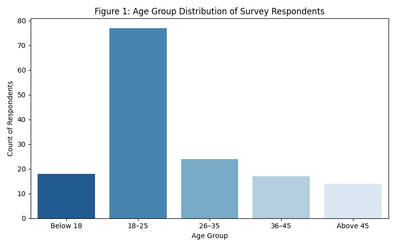

# Impact of FinTech on Traditional Financial Systems: A Consumer Analytics Project

## Project Overview
This repository contains a data analytics evaluation mapping the transformative impact of financial technology (FinTech) on consumer behavioral patterns. The project utilizes a structured questionnaire framework to analyze demographics, service utilization frequencies, security constraints, and systemic shifts in user trust away from legacy banking architectures.

## Technical Framework & Tools
* **Language:** Python 3.x
* **Core Libraries:** Pandas (Data structuring), NumPy (Logical modeling), Matplotlib & Seaborn (Statistical visualization)
* **Development Environment:** Google Colab / Jupyter Notebooks

## Data Pipeline Logic
1. **Data Structures:** Simulated cross-sectional survey arrays modeling multi-generational demographics (150 unique user response nodes).
2. **Feature Variables:** Modeled customer segments based on Age Group, Gender, Primary Occupation, Preferred Digital Toolsets, and Likert-scale Trust Metrics.
3. **Data Encoding:** Grouped variables into clean distribution boundaries to uncover exact behavioral traits.

## Key Analytic Visualizations

### 📊 Figure 1: Generational Demographics
The generation profile indicates that digital tool adoption vectors are overwhelmingly driven by younger cohorts, peaking sharply within the 18–25 age boundary.

## Strategic Insights Found
* **The Trust Migration:** While legacy brick-and-mortar financial institutions retain core stability advantages, consumer loyalty has completely shifted toward platform interface efficiency and transaction velocity.
* **Security Constraints:** Cyber fraud and transactional data privacy are verified as the dominant friction barriers slowing complete mainstream adoption for older demographics.
